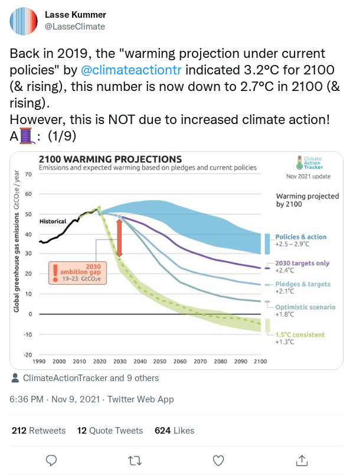

[](https://badge.fury.io/js/tweetzhot) [](https://github.com/ropg/tweetzhot/blob/main/LICENSE) [](https://github.com/ropg/tweetzhot)

# tweetzhot

**Screenshots of single tweets / replies**


&nbsp;

### Introduction


**tweetzhot** lets you make screenshots of single tweets and replies. Comes with a command line tool that, when called with the ID or the URL of a tweet, will output a file `tweet.png`, simple as that. Information about the tweet and the screenshot image (or any errors encountered) is provided on stdout, optionally in JSON format. Options exist to customize what's in the screenshot and to change the width at which it is rendered. There's also a well-documented API. 

&nbsp;

### Prerequisites

* Know how to use a command prompt / terminal
* **[Node.js](https://en.wikipedia.org/wiki/Node.js)** (runs javascript outside of a browser)
* **[npm](https://en.wikipedia.org/wiki/Npm_(software))** (the associated software installer)

(Easy node/npm installers for Mac and Windows are **[here](https://nodejs.org/en/download/)**.)


&nbsp;

### Installation

```text
$ npm install --global tweetzhot
```

(The `--global` is to make sure the command line tool is installed.)

&nbsp;


### Simplest Usage

**Command line:**

```text
$ tweetzhot https://twitter.com/LasseClimate/status/1458141422251503617
Screenshot saved to 'tweet.png'.
Image size: 598 x 804
$ open tweet.png
```

> 

&nbsp;


**example.js:**

```js
require('tweetzhot')({
    tweet: "https://twitter.com/LasseClimate/status/1458141422251503617",
    outputFile: "tweet.png",
    statusFunction: console.log
});
```

```text
$ node example.js 
Screenshot saved to 'tweet.png'.
Image size: 598 x 804
```


&nbsp;

### Command Line Reference

```text
$ tweetzhot --help
tweetzhot <tweet>

Positionals:
  tweet  Twitter URL or ID (digits) of tweet.                           [string]

Options:
      --help           Show help                                       [boolean]
      --version        Show version number                             [boolean]
  -w, --width          Screenshot width. Defaults to 598px, twitter does not
                       render wider, only narrower.
  -c, --cutStats       Cut off rows for replies, retweets, likes, etc. [boolean]
  -o, --outputFile     Filename for screenshot. Formats: png, jpg or webp,
                       selected by extension.    [string] [default: "tweet.png"]
  -j, --json           Output information in JSON format.              [boolean]
  -q, --quiet          Supress status updates                          [boolean]
  -d, --debug          Show browser console and detailed error info.   [boolean]
  -W, --viewportWidth  Viewport width. Normally you would specify the desired
                       screenshot width instead, but you can set the viewport
                       width instead.
  -h, --height         Viewport height, has to be big enough for tweet to fit.
                                                                 [default: 2400]
  -H, --head           disable headless mode                           [boolean]
```


&nbsp;

### API Reference

**example:**

```javascript
const fs = require('fs');
const { exit } = require('process');

const tweetzhot = require('tweetzhot');

const config = {
    tweet: '1458141422251503617',
    outputFile: 'climate-tweet.png'
};

tweetzhot(config)
    .then((res) => {
        const {size} = fs.statSync(res.image.file);
        console.log(`${size} bytes written to ${res.image.file}`);
        console.log(`  image size (${res.image.width} x ${res.image.height}).`);
        console.log(`  twitter user: ${res.tweet.user}`);
    })
    .catch((e) => {
        console.log(`Whoops: ${e.message}`);
        exit(1);
    })
;
```

```text
$ node example.js 
219416 bytes written to climate-tweet.png
  image size (598 x 804).
  twitter user: LasseClimate
```

**config object**

(`tweet` and `outputFile` are mandatory elements.)

  - `consoleFunction` (function) Receives the browser console messages as strings. Set to `console.log` to get these to stdout.
  - `cutStats` (boolean) When this is `true` the buttons and stats for replies, retweets and likes are cut off.
  - `executablePath` (string) Path to a browser executable to run instead of the Chromium that was installed with puppeteer. You're probably better off setting the environment variables if you need to specify this, see [Installation Details](#installation-details) chapter below.
  - `headless` (boolean) Whether browser runs without screen. Defaults to `true`.
  - `height` (number) The height of the browser viewport. Just make sure it's high enough to prevent clipping, the actual tweet screenshot will be much less high.
  - `statusFunction` (function) Receives strings with progress information (i.e. "*Screenshot saved to 'tweet.png'.*", "*Image size: 598 x 804*", error messages, etc). Set to `console.log` to get these to stdout.
  - **`outputFile`** (string) Filename for the resulting image. Formats: png, jpg or webp, selected by extension.
  - **`tweet`** (string) URL or ID (string of digits) of tweet. Although the ID is a number, it has to be provided as a string, see [Tweet IDs](#tweet-ids) below.
  - `viewportWidth` (number) Can be used to set the browser viewport manually. You would normally want to use `width` instead.
  - `width` (number) The width of the output screenshot. Twitter does not render wider than 598 pixels, and much less than 400 becomes quite ugly.


(Apart from holding tweetzhot's own configuration, the `config` object is also passed unmodified as `config` to **[zhot](https://github.com/ropg/zhot#api-reference)**, and via there as `options` to **[puppeteer.launch](https://github.com/puppeteer/puppeteer/blob/v11.0.0/docs/api.md#puppeteerlaunchoptions)**, so if you click these links you may find some more options you could use, although your mileage may vary and not everything makes sense in the context of what **tweetzhot** does.)

**return value**

`tweetzhot` returns a promise that resolves to an object with properties like this:

```json
{
  "tweet": {
    "url": "https://twitter.com/LasseClimate/status/1458141422251503617",
    "user": "LasseClimate",
    "id": "1458141422251503617",
    "language": "en"
  },
  "image": {
    "height": 804,
    "width": 598,
    "type": "png",
    "file": "tweet.png"
  }
}
```

or throws an error, in which case the error message may contain the error as per twitter, such as `Hmm...this page doesn’t exist. Try searching for something else.`


&nbsp;

### Installation Details

**tweetzhot** depends on **[zhot](https://github.com/ropg/zhot)**, which in turn depends on **[puppeteer](https://github.com/puppeteer/puppeteer/blob/main/README.md)**, which in turn installs a Chromium binary that is know to work with it. But many recent versions of Chrome and (experimental support) Firefox will apparently work with it. Puppeteer will only install Chromium for supported operating systems, and FreeBSD (which I use for my server) was not supported. If you run into problems with puppeteer during installation, you might want to try something like this:

```text
export PUPPETEER_SKIP_CHROMIUM_DOWNLOAD=true
export PUPPETEER_EXECUTABLE_PATH=/usr/local/bin/chrome
npm install --global tweetzhot
```

`PUPPETEER_EXECUTABLE_PATH` must be set when you use **tweetzhot** after that, unless you use **tweetzhot**'s node API and specify the binary with `executablePath` in the options. If you want to use the installed copy of Chrome on a Mac, the binary is likely at<br> `/Applications/Google Chrome.app/Contents/MacOS/Google Chrome`.


&nbsp;

### Tweet IDs

Tweets have numbers. But Javascript uses double precision floating point for numbers, which does not provide enough precision for these large numbers. So unless you use specialized libraries for large numbers, only ever treat them as strings.


&nbsp;

### Twitter usernames

Tweets have a URL that has both a username and an ID. But the username part is actually ignored by twitter: the URL is rewritten to hold the username of the actual user that posted the tweet with that number. This is also the username that is returned by tweetzhot, no matter whether you pass ID only, or a URL with the wrong username.
